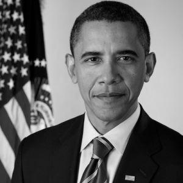

# CS-559
Image Processing algorithms for class

## convert Color Image to Grayscale
This program will read and image as a BufferedImage and converted to
 Grayscale image using the formula  0.2989*red + 0.5870*green + 0.1140*blue

